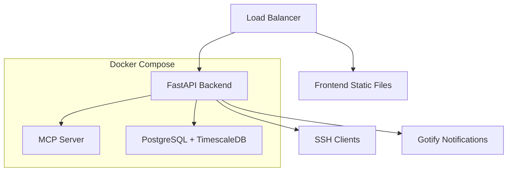

# Infrastructure Management Monorepo

This monorepo contains a complete infrastructure monitoring and management system built with FastAPI, FastMCP, and modern web technologies.

## Project Structure

```
infrastructor/
├── README.md                          # Main project documentation
├── PRD.md                            # Product Requirements Document
├── MONOREPO.md                       # This file - project structure guide
├── TOOLS.md                          # MCP tools documentation
├── SCHEMAS.md                        # API schemas and database schemas
├── FASTAPI-FASTMCP-STREAMABLE-HTTP-SETUP.md  # Implementation guide
├── .env                              # Production environment variables
├── .env.example                      # Environment template
├── .gitignore                        # Git ignore patterns
├── .dockerignore                     # Docker ignore patterns
├── docker-compose.yaml               # Production Docker setup
├── Dockerfile                        # Container build instructions
├── pyproject.toml                    # Python project configuration
├── uv.lock                          # Dependency lock file
│
├── apps/                            # Application packages
│   ├── backend/                     # FastAPI + FastMCP server
│   │   ├── src/
│   │   │   ├── api/                 # FastAPI route handlers
│   │   │   │   ├── __init__.py
│   │   │   │   ├── auth.py          # Authentication endpoints
│   │   │   │   ├── devices.py       # Device management endpoints
│   │   │   │   ├── metrics.py       # Metrics collection endpoints
│   │   │   │   ├── containers.py    # Container management endpoints
│   │   │   │   └── health.py        # Health check endpoints
│   │   │   ├── mcp/                 # MCP server implementation
│   │   │   │   ├── __init__.py
│   │   │   │   ├── server.py        # FastMCP server setup
│   │   │   │   ├── tools/           # MCP tool implementations
│   │   │   │   │   ├── __init__.py
│   │   │   │   │   ├── device_management.py
│   │   │   │   │   ├── metrics_collection.py
│   │   │   │   │   ├── container_management.py
│   │   │   │   │   ├── monitoring.py
│   │   │   │   │   └── ssh_operations.py
│   │   │   │   ├── resources/       # MCP resources
│   │   │   │   │   ├── __init__.py
│   │   │   │   │   ├── device_configs.py
│   │   │   │   │   └── metric_schemas.py
│   │   │   │   └── prompts/         # MCP prompts
│   │   │   │       ├── __init__.py
│   │   │   │       ├── device_analysis.py
│   │   │   │       └── troubleshooting.py
│   │   │   ├── core/                # Core business logic
│   │   │   │   ├── __init__.py
│   │   │   │   ├── config.py        # Configuration management
│   │   │   │   ├── database.py      # Database connection and models
│   │   │   │   ├── security.py      # Authentication and authorization
│   │   │   │   ├── ssh.py           # SSH connection management
│   │   │   │   └── websocket.py     # WebSocket handlers
│   │   │   ├── services/            # Business logic services
│   │   │   │   ├── __init__.py
│   │   │   │   ├── device_service.py     # Device management logic
│   │   │   │   ├── metrics_service.py    # Metrics collection logic
│   │   │   │   ├── container_service.py  # Container management logic
│   │   │   │   ├── polling_service.py    # Background polling logic
│   │   │   │   └── notification_service.py  # Gotify notifications
│   │   │   ├── models/              # Database models
│   │   │   │   ├── __init__.py
│   │   │   │   ├── device.py        # Device models
│   │   │   │   ├── metrics.py       # Metrics models
│   │   │   │   ├── container.py     # Container models
│   │   │   │   └── user.py          # User/auth models
│   │   │   ├── schemas/             # Pydantic schemas
│   │   │   │   ├── __init__.py
│   │   │   │   ├── device.py        # Device request/response schemas
│   │   │   │   ├── metrics.py       # Metrics schemas
│   │   │   │   ├── container.py     # Container schemas
│   │   │   │   └── auth.py          # Authentication schemas
│   │   │   ├── utils/               # Utility functions
│   │   │   │   ├── __init__.py
│   │   │   │   ├── ssh_client.py    # SSH client utilities
│   │   │   │   ├── parsers.py       # Command output parsers
│   │   │   │   ├── validators.py    # Input validation
│   │   │   │   └── formatters.py    # Output formatting
│   │   │   └── main.py              # FastAPI application entry point
│   │   ├── tests/                   # Backend tests
│   │   │   ├── __init__.py
│   │   │   ├── conftest.py          # Pytest configuration
│   │   │   ├── test_api/            # API endpoint tests
│   │   │   ├── test_mcp/            # MCP server tests
│   │   │   ├── test_services/       # Service layer tests
│   │   │   └── test_utils/          # Utility tests
│   │   └── pyproject.toml           # Backend-specific dependencies
│   │
│   └── frontend/                    # Web UI (future implementation)
│       ├── package.json             # Node.js dependencies
│       ├── tsconfig.json            # TypeScript configuration
│       ├── vite.config.ts           # Vite build configuration
│       ├── tailwind.config.js       # Tailwind CSS configuration
│       ├── src/
│       │   ├── components/          # React components
│       │   │   ├── ui/              # Reusable UI components
│       │   │   ├── device/          # Device management components
│       │   │   ├── metrics/         # Metrics visualization components
│       │   │   └── containers/      # Container management components
│       │   ├── pages/               # Page components
│       │   │   ├── Dashboard.tsx    # Main dashboard
│       │   │   ├── Devices.tsx      # Device management page
│       │   │   ├── Metrics.tsx      # Metrics visualization page
│       │   │   └── Containers.tsx   # Container management page
│       │   ├── hooks/               # Custom React hooks
│       │   ├── utils/               # Frontend utilities
│       │   ├── types/               # TypeScript type definitions
│       │   ├── api/                 # API client
│       │   ├── stores/              # State management (Zustand/Redux)
│       │   ├── App.tsx              # Main application component
│       │   └── main.tsx             # Application entry point
│       ├── public/                  # Static assets
│       └── dist/                    # Build output (gitignored)
│
├── packages/                        # Shared packages
│   ├── shared-types/                # Shared TypeScript types
│   │   ├── package.json
│   │   ├── src/
│   │   │   ├── api.ts               # API interface types
│   │   │   ├── device.ts            # Device-related types
│   │   │   ├── metrics.ts           # Metrics types
│   │   │   └── container.ts         # Container types
│   │   └── tsconfig.json
│   │
│   └── shared-utils/                # Shared utility functions
│       ├── package.json
│       ├── src/
│       │   ├── validation.ts        # Shared validation logic
│       │   ├── formatting.ts        # Data formatting utilities
│       │   └── constants.ts         # Shared constants
│       └── tsconfig.json
│
├── scripts/                         # Development and deployment scripts
│   ├── setup.sh                     # Initial project setup
│   ├── dev.sh                       # Development environment startup
│   ├── build.sh                     # Production build script
│   ├── deploy.sh                    # Deployment script
│   ├── backup.sh                    # Database backup script
│   └── migrate.sh                   # Database migration script
│
├── init-scripts/                    # Database initialization scripts
│   ├── 01-create-extensions.sql     # TimescaleDB extension setup
│   ├── 02-create-tables.sql         # Table creation
│   ├── 03-create-hypertables.sql    # TimescaleDB hypertables
│   └── 04-create-indexes.sql        # Database indexes
│
├── logs/                            # Application logs (gitignored)
│   ├── postgres/                    # PostgreSQL logs
│   ├── app/                         # Application logs
│   └── nginx/                       # Nginx logs (if used)
│
├── docs/                            # Additional documentation
│   ├── api/                         # API documentation
│   ├── deployment/                  # Deployment guides
│   └── development/                 # Development guides
│
└── tools/                           # Development tools and utilities
    ├── linting/                     # Linting configurations
    │   ├── eslint.config.js         # ESLint v9+ flat configuration
    │   ├── .prettierrc              # Prettier configuration
    │   └── ruff.toml                # Python Ruff configuration
    └── testing/                     # Testing utilities
        ├── fixtures/                # Test fixtures
        └── helpers/                 # Test helper functions
```

## Monorepo Best Practices

### 1. Package Management

- **Python**: Use `uv` for dependency management with workspace support
- **Node.js**: Use pnpm workspaces for shared dependencies
- **Shared Dependencies**: Common dependencies in root, app-specific in respective directories

### 2. Build System

- **Backend**: FastAPI with uvicorn, built using uv
- **Frontend**: Vite for fast development and optimized production builds
- **Docker**: Multi-stage builds for optimized production images

### 3. Code Organization

#### Backend (`apps/backend/`)
- **api/**: FastAPI route handlers (REST endpoints)
- **mcp/**: MCP server implementation with tools, resources, and prompts
- **core/**: Configuration, database, security, and core infrastructure
- **services/**: Business logic layer
- **models/**: SQLAlchemy database models
- **schemas/**: Pydantic request/response schemas
- **utils/**: Pure utility functions

#### Frontend (`apps/frontend/`)
- **components/**: Reusable React components organized by domain
- **pages/**: Route-level page components
- **hooks/**: Custom React hooks for business logic
- **stores/**: Global state management
- **api/**: HTTP client and API integration

#### Shared Packages (`packages/`)
- **shared-types/**: TypeScript interfaces shared between frontend and backend
- **shared-utils/**: Common utility functions used across applications

### 4. Development Workflow

```bash
# Install all dependencies
uv sync
cd apps/frontend && pnpm install

# Development mode
./scripts/dev.sh

# Run tests
cd apps/backend && uv run pytest
cd apps/frontend && pnpm test

# Build for production
./scripts/build.sh

# Deploy
./scripts/deploy.sh
```

### 5. Configuration Management

- **Environment Variables**: Centralized in `.env` files
- **Application Config**: Type-safe configuration classes in `core/config.py`
- **Database**: PostgreSQL with TimescaleDB for time-series optimization
- **Secrets**: Never committed, managed through environment variables

### 6. Testing Strategy

- **Backend**: pytest with fixtures and factory patterns
- **Frontend**: Vitest + React Testing Library
- **Integration**: End-to-end tests using Playwright
- **API**: OpenAPI schema validation tests

### 7. Deployment Architecture



### 8. Port Allocation

- **PostgreSQL**: 9100
- **Backend API**: 9101 
- **WebSocket**: 9102
- **Frontend Dev**: 9103 (development only)
- **MCP Server**: 9105 -- Embedded in FastAPI on '/mcp' path

### 9. Data Flow

1. **FastAPI** serves REST endpoints for direct API access
2. **FastMCP** auto-generates MCP tools from FastAPI endpoints
3. **Custom MCP tools** provide LLM-optimized interfaces
4. **WebSocket** handles real-time updates
5. **TimescaleDB** stores time-series metrics efficiently
6. **SSH clients** communicate with remote devices over Tailscale

### 10. Future Extensibility

- **Microservices**: Each app can be deployed independently
- **API Versioning**: Built into FastAPI structure
- **Plugin System**: MCP tools can be dynamically loaded
- **Multi-tenant**: User/organization isolation ready
- **Horizontal Scaling**: Stateless design supports scaling

This structure follows monorepo best practices while maintaining clear separation of concerns and enabling independent development and deployment of components.
