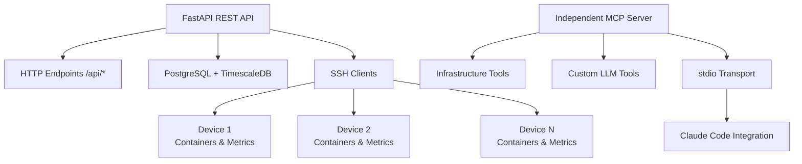

# Infrastructor

A comprehensive infrastructure monitoring and management system with separated FastAPI REST API and independent MCP server, providing traditional HTTP endpoints and AI-optimized tools for managing containerized services across multiple devices.

## 🚀 Features

- **Separated Architecture**: Independent FastAPI REST API + standalone MCP server for optimal performance
- **Real-time Monitoring**: Container status, system metrics, and drive health across multiple devices
- **SSH-based Communication**: Secure device management over Tailscale network
- **Time-series Data**: PostgreSQL + TimescaleDB for efficient metrics storage
- **WebSocket Streaming**: Live data feeds for external applications
- **Docker Integration**: Container discovery, management, and log streaming
- **ZFS Support**: Pool health, snapshot integrity, and scrub monitoring
- **LLM-Optimized Tools**: Purpose-built MCP tools for infrastructure analysis
- **Gotify Notifications**: Real-time alerts and status updates via Gotify integration

## 📋 Requirements

- Python 3.11+
- PostgreSQL 15+ with TimescaleDB extension
- SSH key access to monitored devices
- Tailscale network connectivity
- UV package manager

## 🏗️ Architecture

### System Components



### Port Allocation

- **PostgreSQL**: 9100
- **FastAPI REST API**: 9101
- **WebSocket**: 9102 (future)
- **Frontend Dev**: 9103 (future)
- **MCP Server**: Independent stdio process (no port)

## 🚀 Quick Start

### 1. Clone and Setup

```bash
git clone https://github.com/jmagar/infrastructor.git
cd infrastructor
```

### 2. Install Dependencies

```bash
# Install UV if not already installed
curl -LsSf https://astral.sh/uv/install.sh | sh

# Install project dependencies
uv sync
```

### 3. Environment Configuration

```bash
cp .env.example .env
# Edit .env with your configuration
```

### 4. Database Setup

```bash
# Start PostgreSQL with TimescaleDB
docker compose up postgres -d

# Wait for database to be ready
docker compose logs postgres
```

### 5. Development Server

```bash
# Activate virtual environment
source .venv/bin/activate

# Run FastAPI REST API server
uv run uvicorn apps.backend.src.main:app --reload --host 0.0.0.0 --port 9101

# Run MCP server (separate terminal for Claude Code integration)
python mcp_server.py
```

## 📁 Project Structure

```
infrastructor/
├── apps/backend/           # FastAPI REST API application
│   ├── src/
│   │   ├── api/           # REST API endpoints
│   │   ├── mcp/           # MCP tools (used by independent server)
│   │   ├── core/          # Configuration and database
│   │   ├── services/      # Business logic
│   │   ├── models/        # Database models
│   │   └── schemas/       # Pydantic schemas
│   └── tests/             # Backend tests
├── apps/frontend/         # Web UI (future)
├── packages/              # Shared packages
├── scripts/               # Development scripts
├── mcp_server.py          # Independent MCP server for Claude Code
├── init-scripts/          # Database initialization
├── logs/                  # Application logs
└── docs/                  # Documentation
```

## 🔧 Configuration

### Environment Variables

Key configuration options in `.env`:

```bash
# Database
POSTGRES_HOST=localhost
POSTGRES_PORT=9100
POSTGRES_DB=infrastructor
POSTGRES_USER=infrastructor
POSTGRES_PASSWORD=your_secure_password

# MCP Server
MCP_HOST=0.0.0.0
MCP_PORT=9101
MCP_PATH=/mcp

# SSH Configuration
SSH_KEY_PATH=~/.ssh/id_ed25519
SSH_CONNECTION_TIMEOUT=30
SSH_COMMAND_TIMEOUT=60

# Authentication
JWT_SECRET_KEY=your_jwt_secret
API_KEY=your_api_key

# External Integrations
GOTIFY_URL=https://your-gotify-instance.com
GOTIFY_TOKEN=your_gotify_token
```

### Device Registration

**Automatic Discovery** (Recommended):
```bash
# Auto-discover devices from Tailscale network
curl -X POST http://localhost:9101/api/devices/discover/tailscale \\
  -H "X-API-Key: your_api_key"

# Auto-discover devices from SSH config
curl -X POST http://localhost:9101/api/devices/discover/ssh-config \\
  -H "X-API-Key: your_api_key"
```

**Manual Registration**:
```bash
curl -X POST http://localhost:9101/api/devices \\
  -H "Content-Type: application/json" \\
  -H "X-API-Key: your_api_key" \\
  -d '{
    "hostname": "server1",
    "ip_address": "100.64.1.100",
    "ssh_user": "root",
    "device_type": "ubuntu_physical"
  }'
```

The system can automatically discover devices using:
- **Tailscale CLI**: `tailscale status` to find all connected devices
- **SSH Config**: Parse `~/.ssh/config` for pre-configured hosts
- **Network Scanning**: Discover devices on Tailscale subnet (optional)

## 🛠️ Development

### Running Tests

```bash
# Run all tests
uv run pytest

# Run with coverage
uv run pytest --cov=src

# Run specific tests
uv run pytest apps/backend/tests/test_api/
```

### Code Quality

```bash
# Linting and formatting
uv run ruff check .
uv run ruff format .

# Type checking
uv run mypy src/
```

### Database Migrations

```bash
# Generate migration
uv run alembic revision --autogenerate -m "Description"

# Apply migrations
uv run alembic upgrade head
```

## 📡 API Interfaces

Infrastructor provides **three complementary interfaces** for different integration patterns:

### 1. REST API (`/api/*`)
**Traditional HTTP endpoints** for direct programmatic integration:

```bash
# Device management
curl http://localhost:9101/api/devices
curl http://localhost:9101/api/devices/server1

# Container operations
curl http://localhost:9101/api/containers
curl http://localhost:9101/api/containers/server1/nginx-proxy
curl http://localhost:9101/api/containers/server1/nginx-proxy/logs

# System monitoring
curl http://localhost:9101/api/metrics/server1
curl http://localhost:9101/api/drives/server1
curl http://localhost:9101/api/zfs/server1/status

# Network topology
curl http://localhost:9101/api/network/topology

# Backup status
curl http://localhost:9101/api/backups/server1
```

**Features:**
- OpenAPI documentation at `/docs`
- API key authentication (`X-API-Key` header)
- JSON responses with consistent error handling
- Historical metrics with TimescaleDB aggregation

### 2. MCP Interface (`/mcp`)
**LLM-optimized tools** for AI-powered infrastructure management:

**Connection Configuration:**
```json
{
  "mcpServers": {
    "infrastructure-server": {
      "command": "python",
      "args": ["server.py"],
      "transport": {
        "type": "http",
        "url": "http://localhost:9101/mcp"
      }
    }
  }
}
```

**Available Tools (17 total):**
- **Container Management (4)**: `list_containers`, `get_container_details`, `get_container_logs`, `get_service_dependencies`
- **System Monitoring (3)**: `get_system_metrics`, `get_drive_health`, `get_system_logs`
- **ZFS Management (3)**: `get_zfs_status`, `get_zfs_snapshots`, `verify_zfs_integrity`
- **Network Tools (2)**: `get_network_topology`, `list_docker_networks`
- **Backup & Maintenance (2)**: `get_backup_status`, `check_updates`
- **Utility Tools (3)**: `list_devices`, `get_device_info`, `get_vm_status`

**Features:**
- JWT bearer token authentication
- Auto-generated from REST API + custom LLM-optimized tools
- Context management with progress reporting
- Resources and prompts for infrastructure analysis

### 3. WebSocket API (`/ws`)
**Real-time streaming** for live monitoring and dashboards:

```javascript
const ws = new WebSocket('ws://localhost:9102/ws?token=jwt-token');

// Subscribe to events
ws.send(JSON.stringify({
  type: 'subscribe',
  subscriptions: [
    {
      event_type: 'system_metrics',
      device_filter: ['server01', 'server02'],
      rate_limit: 1
    },
    {
      event_type: 'container_update',
      device_filter: ['server01']
    },
    {
      event_type: 'alerts'
    }
  ]
}));

ws.onmessage = (event) => {
  const message = JSON.parse(event.data);
  console.log('Live update:', message);
};
```

**Message Types:** `system_metrics`, `container_update`, `device_status`, `alert`

### Complete API Documentation

For comprehensive API reference including:
- **Endpoint specifications** with parameters and responses
- **Authentication patterns** for each interface
- **Error handling** and status codes
- **Rate limiting** and headers
- **Implementation examples** in Python and JavaScript
- **MCP resources and prompts**
- **WebSocket message schemas**

**See: @API.md**

## 🚀 Deployment

### Current Deployment (Development)

- **PostgreSQL**: Docker container
- **Application**: Local development server

```bash
# Production database
docker compose up postgres -d

# Development server
uv run uvicorn src.main:app --host 0.0.0.0 --port 9101
```

### Future Deployment (Full Container)

```bash
# Full containerized deployment (when ready)
docker compose up -d
```

## 📊 Monitoring

### Health Checks

```bash
# Application health
curl http://localhost:9101/health

# Database health
curl http://localhost:9101/health/db

# MCP server status
curl http://localhost:9105/health
```

### Logs

```bash
# Application logs
tail -f logs/app/infrastructor.log

# PostgreSQL logs
docker compose logs postgres -f
```

## 🤝 Contributing

1. Fork the repository
2. Create a feature branch (`git checkout -b feature/amazing-feature`)
3. Commit your changes (`git commit -m 'Add amazing feature'`)
4. Push to the branch (`git push origin feature/amazing-feature`)
5. Open a Pull Request

### Development Guidelines

- Follow the monorepo structure in `MONOREPO.md`
- Keep modules under 500 lines when possible
- Write tests for new features
- Use type hints throughout
- Follow the existing code style (Ruff configuration)

## 📚 Documentation

- **@PRD.md** - Product Requirements Document with technical architecture
- **@API.md** - Complete API reference for REST, MCP, and WebSocket interfaces
- **@TOOLS.md** - All 17 MCP tools with detailed descriptions and examples
- **@SCHEMAS.md** - TypeScript interfaces, database DDL, and Pydantic models
- **@MONOREPO.md** - Project structure and development patterns
- **@FASTAPI-FASTMCP-STREAMABLE-HTTP-SETUP.md** - FastAPI + MCP integration guide
- **@CLAUDE.md** - Development guide and workflow instructions

## 🔐 Security

- SSH key-based device authentication
- JWT tokens for API access
- API key authentication for external integrations
- No credentials stored in repository (use environment variables)
- Regular security updates via Dependabot

## 📈 Roadmap

### Phase 1: MVP Foundation 🚧
- [ ] MCP server framework
- [ ] Device registry and SSH management
- [ ] PostgreSQL + TimescaleDB setup
- [ ] Basic container discovery

### Phase 2: Monitoring & Health 🚧
- [ ] Drive health monitoring (SMART data)
- [ ] ZFS pool status and health checks
- [ ] Background polling engine
- [ ] Historical data storage

### Phase 3: Logging & Diagnostics
- [ ] System log access and searching
- [ ] Container log streaming
- [ ] Log aggregation capabilities

### Phase 4: Advanced Features
- [ ] Service dependency mapping
- [ ] VM status monitoring
- [ ] Backup job verification
- [ ] Update management

### Phase 5: Web Frontend
- [ ] React-based dashboard
- [ ] Real-time data visualization
- [ ] Mobile-responsive design
- [ ] Progressive Web App features


## 📄 License

This project is licensed under the MIT License - see the [LICENSE](LICENSE) file for details.

## 👥 Authors

- **Infrastructure Team** - *Initial work*

## 🙏 Acknowledgments

- [FastAPI](https://fastapi.tiangolo.com/) - Modern web framework
- [FastMCP](https://github.com/jlowin/fastmcp) - MCP server integration
- [TimescaleDB](https://www.timescale.com/) - Time-series database
- [UV](https://github.com/astral-sh/uv) - Python package manager
- [Tailscale](https://tailscale.com/) - Secure networking

---

**Status**: 🚧 Active Development | **Version**: 1.0.0-dev | **Python**: 3.11+