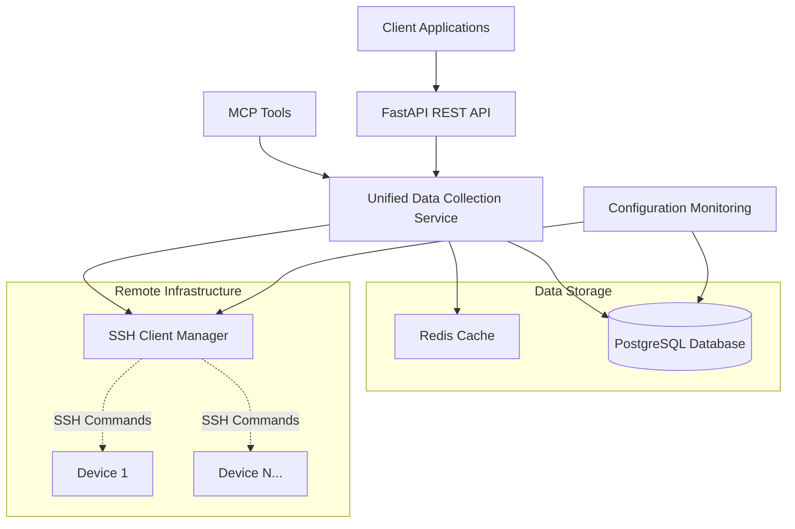

# Infrastructor Architecture Design Document

## Overview

Infrastructor is a comprehensive infrastructure management and monitoring platform built with a unified data collection architecture. The system provides real-time monitoring, configuration tracking, and management capabilities for heterogeneous Linux environments through a dual-server design with consistent data access patterns.

## Core Architectural Principles

### 1. Unified Data Collection
All data operations—whether initiated from REST API endpoints or MCP tools—use the same underlying unified data collection service. This ensures:
- **Consistency**: Identical behavior across all access methods
- **Performance**: Shared caching and optimization strategies
- **Maintainability**: Single source of truth for data collection logic
- **Audit Trail**: Complete tracking of all operations

### 2. Direct Service Integration
The architecture eliminates HTTP middleware layers between components, with both API endpoints and MCP tools calling services directly:
```
API Endpoints ──┐
                ├──→ Unified Data Collection Service ──→ SSH/Database
MCP Tools    ──┘
```

### 3. Real-time Configuration Monitoring
File system watchers with intelligent fallback mechanisms provide real-time configuration change detection and automatic ingestion.

## System Architecture

### High-Level Components



### Server Architecture

#### Primary Server (Port 9101)
- **FastAPI Application**: REST API endpoints with comprehensive middleware
- **WebSocket Server**: Real-time event streaming
- **Database Integration**: PostgreSQL with SQLAlchemy async ORM
- **Caching Layer**: Redis integration with intelligent TTL management
- **Authentication**: Bearer token with JWT support

#### MCP Server (Port 9102)
- **Independent Process**: Standalone FastMCP server
- **Tool Registry**: 45 MCP tools across 6 categories
- **Resource Management**: 27 resources with real-time access
- **Direct Service Calls**: No HTTP dependency on primary server

#### Database (Port 9100)
- **PostgreSQL**: Primary data store with advanced indexing
- **Time-series Optimization**: Efficient storage for metrics data
- **JSONB Support**: Flexible metadata and configuration storage
- **Referential Integrity**: Proper foreign key relationships

#### Redis Cache (Port 9104)
- **LRU Eviction**: Intelligent cache management
- **TTL Support**: Configurable time-to-live policies
- **Performance Metrics**: Hit ratio and response time tracking
- **Memory Management**: Automatic cleanup and size limits

## Unified Data Collection Service

### Architecture Pattern

The Unified Data Collection Service implements a standardized pattern for all data operations:

```python
async def collect_and_store_data(
    collection_method: Callable[[], Awaitable[Dict[str, Any]]],
    device_id: Union[str, UUID],
    data_type: str,
    cache_ttl: Optional[int] = None,
    force_refresh: bool = False
) -> Dict[str, Any]
```

### Key Features

#### 1. Cache-First Strategy
```python
# Check cache first
cached_data = await self.cache_manager.get(data_type, device_id)
if cached_data and not force_refresh:
    return cached_data

# Collect fresh data if cache miss
fresh_data = await collection_method()
await self.cache_manager.set(data_type, device_id, fresh_data, ttl=cache_ttl)
```

#### 2. Comprehensive Audit Trail
Every data collection operation is logged with:
- Unique operation ID and correlation tracking
- Timestamp and execution duration
- Cache hit/miss status and performance metrics
- Error details and retry information
- Device and data type metadata

#### 3. Error Handling & Resilience
- **Structured Exceptions**: Custom exception hierarchy with proper chaining
- **Retry Logic**: Configurable retry policies for transient failures
- **Graceful Degradation**: Fallback mechanisms for service unavailability
- **Circuit Breaker**: Protection against cascading failures

### SSH Command Management

#### SSH Client Architecture
```python
class SSHClient:
    async def execute_command(
        connection_info: SSHConnectionInfo,
        command: str,
        timeout: int = 30
    ) -> SSHResult
```

#### Advanced SSH Command Manager
The system includes a sophisticated SSH command manager with:
- **Command Registry**: Predefined templates with parameter substitution
- **Built-in Parsers**: Automatic output parsing for common commands
- **Connection Pooling**: Efficient connection reuse and management
- **Command Caching**: TTL-based caching with invalidation policies
- **Retry Logic**: Exponential backoff for failed connections

## Configuration Monitoring System

### Real-time File Watching

#### Architecture Overview
```python
class RemoteFileWatcher:
    def __init__(self, device_id, ssh_client, watch_paths, callback):
        self.inotify_monitor = InotifyMonitor()
        self.polling_fallback = PollingMonitor()
        self.file_hashes = {}  # Change detection
```

#### Monitoring Strategy
1. **Primary**: inotify-based real-time monitoring via SSH
2. **Fallback**: Hash-based polling with configurable intervals
3. **Initial Scan**: Bulk processing of existing configurations on startup

#### Supported Configuration Types
- **SWAG Proxy Configs**: `*.conf` files in `/*/swag/nginx/proxy-confs/`
- **Docker Compose**: `*.yml`, `*.yaml` files in compose directories
- **System Configs**: Nginx, Apache, Traefik configurations
- **Generic Configs**: JSON, YAML, and INI-style configuration files

### Configuration Processing Pipeline

#### 1. Change Detection
```python
async def _handle_file_event(self, filepath: str, event_type: str) -> None:
    # Determine configuration type
    config_type = self._determine_config_type(filepath)
    
    # Read and hash content
    content_hash = hashlib.sha256(raw_content.encode()).hexdigest()
    
    # Parse configuration (basic metadata extraction)
    parsed_data = await self._parse_config_file(filepath, raw_content)
    
    # Store snapshot
    await self._store_configuration_snapshot(...)
```

#### 2. Database Integration
Configuration changes are stored in `configuration_snapshots` table with:
- **Content Hash**: SHA256 for change detection
- **Raw Content**: Full file content for analysis
- **Parsed Metadata**: Basic structure and metrics
- **Change Tracking**: CREATE, MODIFY, DELETE operations
- **Temporal Data**: Timestamps for change history

#### 3. Discovery Integration
The system automatically discovers configuration paths from device analysis:
- **SWAG Detection**: Running containers + nginx directory validation
- **Docker Compose Paths**: Extracted from container analysis
- **Appdata Directories**: Service-specific configuration locations

## API Architecture

### RESTful Design Patterns

#### Endpoint Structure
- **`/api/devices`**: Device lifecycle management and monitoring
- **`/api/containers`**: Docker container operations and status
- **`/api/proxies`**: SWAG reverse proxy configuration management
- **`/api/zfs`**: ZFS filesystem operations (16 specialized endpoints)

#### Request/Response Pattern
```python
@router.get("/endpoint")
async def endpoint_handler(
    # Path and query parameters
    param: str = Path(..., description="Parameter description"),
    filter: Optional[str] = Query(None, description="Optional filter"),
    # Dependency injection
    service: Service = Depends(get_service),
    current_user = Depends(get_current_user)
) -> ResponseModel:
```

#### Data Flow Architecture

##### Before Refactoring (Eliminated)
```
API Endpoint → HTTP Call → MCP Tool → SSH Command → Device
     ↓              ↓           ↓
   Database    Duplicate   Cache Miss
```

##### After Refactoring (Current)
```
API Endpoint ──┐
               ├──→ Unified Data Collection Service ──→ SSH ──→ Device
MCP Tool    ──┘              ↓                              
                          Database + Cache (Shared)
```

### Error Handling Strategy

#### Exception Hierarchy
```python
class InfrastructorError(Exception): pass
class DataCollectionError(InfrastructorError): pass
class SSHConnectionError(InfrastructorError): pass
class DatabaseOperationError(InfrastructorError): pass
class CacheOperationError(InfrastructorError): pass
```

#### HTTP Status Mapping
- **400**: Validation errors, malformed requests
- **401**: Authentication required
- **403**: Insufficient permissions
- **404**: Resource not found
- **409**: Conflict (duplicate resources)
- **503**: Service unavailable (SSH/database connectivity)
- **500**: Internal server errors

## MCP (Model Context Protocol) Integration

### Tool Categories (45+ Tools)

#### 1. Container Management (9 tools)
- **Container Operations**: List, inspect, start, stop, restart, remove
- **Container Monitoring**: Real-time stats, logs, health checks, execute commands
- **Container Lifecycle**: Full lifecycle management with resource monitoring

#### 2. System Monitoring (3 tools)
- **Drive Health**: S.M.A.R.T. monitoring and predictive analysis
- **Drive Statistics**: I/O performance and utilization metrics
- **System Logs**: Multi-source log aggregation (journald, Docker, services)

#### 3. Device Management (4 tools)
- **Device Registry**: Registration, discovery, lifecycle management (add, edit, remove, list)
- **Device Analysis**: Comprehensive capability and service discovery
- **SSH Config Import**: Bulk device import from SSH configuration files

#### 4. Proxy Management (5 tools)
- **Configuration Discovery**: SWAG config scanning and parsing
- **Template Management**: Subdomain/subfolder templates
- **Sample Configurations**: Pre-built service configurations
- **Real-time Sync**: File system integration and change tracking
- **Summary Analytics**: Configuration statistics and overview

#### 5. Docker Compose Deployment (6 tools)
- **Compose Modification**: Adapt compose files for target devices
- **Full Deployment**: Complete deployment with directory creation
- **Combined Operations**: Modify and deploy in single operation
- **Port Scanning**: Conflict detection and recommendations
- **Network Analysis**: Docker network topology discovery
- **Proxy Generation**: Automatic SWAG configuration creation

#### 6. ZFS Management (16 tools)
**Pool Management (2)**: Pool listing, detailed status and health
**Dataset Management (2)**: Dataset enumeration, comprehensive property inspection
**Snapshot Management (6)**: Create, clone, send/receive, diff analysis
**Health Monitoring (3)**: Comprehensive health checks, ARC stats, event monitoring
**Analysis & Reporting (3)**: System reports, snapshot usage analysis, optimization recommendations

#### 7. Infrastructure Operations (2+ tools)
- **Port Analysis**: Network port scanning and process mapping
- **Service Dependencies**: Automatic service relationship discovery

### Resource Categories (27+ Resources)

#### Resource URI Patterns
- **`swag://service-name`**: Proxy configuration access
- **`docker://stack-name`**: Compose stack discovery
- **`zfs://pool-name/dataset`**: ZFS resource management
- **`logs://source/filter`**: Log stream access
- **`ports://device/analysis`**: Network port scanning
- **`config://device/path`**: Configuration file access

#### Real-time Resource Access
Resources provide live access to remote infrastructure without API calls:
```python
async def get_proxy_config_resource(uri: str) -> Dict[str, Any]:
    # Direct SSH access to configuration files
    # Real-time content retrieval
    # Automatic caching with TTL
```

## Database Schema Design

### Core Tables

#### devices
```sql
CREATE TABLE devices (
    id UUID PRIMARY KEY,
    hostname VARCHAR(255) UNIQUE NOT NULL,
    device_type VARCHAR(100) NOT NULL DEFAULT 'server',
    monitoring_enabled BOOLEAN DEFAULT true,
    ssh_port INTEGER DEFAULT 22,
    ssh_username VARCHAR(100),
    ssh_private_key_path VARCHAR(500),
    tags JSONB DEFAULT '{}',
    created_at TIMESTAMPTZ DEFAULT NOW(),
    updated_at TIMESTAMPTZ DEFAULT NOW()
);

CREATE INDEX idx_devices_hostname ON devices(hostname);
CREATE INDEX idx_devices_monitoring ON devices(monitoring_enabled);
CREATE INDEX idx_devices_tags_gin ON devices USING GIN(tags);
```

#### configuration_snapshots
```sql
CREATE TABLE configuration_snapshots (
    id UUID PRIMARY KEY,
    device_id UUID REFERENCES devices(id) ON DELETE CASCADE,
    time TIMESTAMPTZ NOT NULL,
    config_type VARCHAR(100) NOT NULL,
    file_path TEXT NOT NULL,
    content_hash VARCHAR(64) NOT NULL,
    raw_content TEXT,
    parsed_data JSONB,
    change_type VARCHAR(50) NOT NULL,
    created_at TIMESTAMPTZ DEFAULT NOW()
);

CREATE INDEX idx_config_snapshots_device_time ON configuration_snapshots(device_id, time DESC);
CREATE INDEX idx_config_snapshots_type ON configuration_snapshots(config_type);
CREATE INDEX idx_config_snapshots_path ON configuration_snapshots(file_path);
CREATE INDEX idx_config_snapshots_hash ON configuration_snapshots(content_hash);
```

#### system_metrics
```sql
CREATE TABLE system_metrics (
    id UUID PRIMARY KEY,
    device_id UUID REFERENCES devices(id) ON DELETE CASCADE,
    timestamp TIMESTAMPTZ NOT NULL,
    cpu_usage_percent DECIMAL(5,2),
    memory_usage_percent DECIMAL(5,2),
    disk_usage_percent DECIMAL(5,2),
    load_average_1m DECIMAL(6,2),
    uptime_seconds BIGINT,
    metadata JSONB DEFAULT '{}'
);

CREATE INDEX idx_system_metrics_device_time ON system_metrics(device_id, timestamp DESC);
CREATE INDEX idx_system_metrics_timestamp ON system_metrics(timestamp);
```

#### container_snapshots
```sql
CREATE TABLE container_snapshots (
    id UUID PRIMARY KEY,
    device_id UUID REFERENCES devices(id) ON DELETE CASCADE,
    snapshot_time TIMESTAMPTZ NOT NULL,
    container_data JSONB NOT NULL,
    created_at TIMESTAMPTZ DEFAULT NOW()
);

CREATE INDEX idx_container_snapshots_device_time ON container_snapshots(device_id, snapshot_time DESC);
CREATE INDEX idx_container_snapshots_data_gin ON container_snapshots USING GIN(container_data);
```

### Data Retention Policies

#### Time-series Data Management
- **system_metrics**: 90-day retention with optional aggregation
- **container_snapshots**: 30-day retention for detailed data
- **configuration_snapshots**: Indefinite retention (configuration history)
- **data_collection_audit**: 365-day retention for compliance

#### Cleanup Strategies
```python
# Automated cleanup policies
RETENTION_POLICIES = {
    "system_metrics": timedelta(days=90),
    "container_snapshots": timedelta(days=30),
    "data_collection_audit": timedelta(days=365),
    "configuration_snapshots": None  # Indefinite retention
}
```

## Caching Strategy

### Redis Architecture

#### Cache Manager Features
```python
class CacheManager:
    def __init__(self):
        self.lru_eviction = LRUEvictionPolicy()
        self.performance_metrics = CacheMetrics()
        self.memory_management = MemoryManager()
```

#### Caching Policies
- **Default TTL**: 300 seconds (5 minutes)
- **System Metrics**: 60 seconds (high-frequency data)
- **Container Status**: 30 seconds (dynamic state)
- **Configuration Data**: 900 seconds (15 minutes, slower changing)
- **Device Analysis**: 3600 seconds (1 hour, expensive operations)

#### Cache Key Structure
```
infra_cache:{data_type}:{device_id}:{additional_key}
```

Examples:
- `infra_cache:system_metrics:uuid-here:`
- `infra_cache:containers:uuid-here:`
- `infra_cache:proxy_configurations:uuid-here:service-name`

#### Performance Optimization
- **LRU Eviction**: Automatic cleanup of least-recently-used items
- **Memory Monitoring**: Configurable size limits and batch eviction
- **Hit Ratio Tracking**: Performance metrics and optimization insights
- **Connection Pooling**: Efficient Redis connection management

### Cache Integration Patterns

#### Cache-Through Pattern
```python
async def get_data(data_type: str, device_id: str) -> Dict:
    # 1. Check cache first
    cached = await cache_manager.get(data_type, device_id)
    if cached:
        return cached
    
    # 2. Collect fresh data
    fresh_data = await collection_method()
    
    # 3. Store in cache
    await cache_manager.set(data_type, device_id, fresh_data)
    
    return fresh_data
```

#### Write-Through Pattern
```python
async def store_data(data_type: str, device_id: str, data: Dict) -> bool:
    # 1. Write to database
    await database.store(data)
    
    # 2. Update cache
    await cache_manager.set(data_type, device_id, data)
    
    return True
```

## Security Architecture

### Authentication & Authorization

#### Bearer Token Authentication
```python
async def get_current_user(
    authorization: str = Header(...),
    db: AsyncSession = Depends(get_db_session)
) -> User:
    token = extract_bearer_token(authorization)
    return await validate_token(token, db)
```

#### SSH Security
- **Ed25519 Keys**: Modern cryptographic standards
- **Connection Timeouts**: Protection against hung connections
- **Retry Limits**: Protection against brute force attempts
- **Key Path Validation**: Secure key storage and access

### Network Security

#### CORS Configuration
```python
app.add_middleware(
    CORSMiddleware,
    allow_origins=ALLOWED_ORIGINS,
    allow_credentials=True,
    allow_methods=["GET", "POST", "PUT", "DELETE"],
    allow_headers=["*"]
)
```

#### Rate Limiting
- **Per-endpoint limits**: Configurable request rates
- **IP-based throttling**: Protection against abuse
- **User-based limits**: Per-user quotas
- **Burst handling**: Short-term rate spikes

### Data Security

#### Sensitive Data Handling
- **SSH Credentials**: Encrypted storage and secure access
- **API Keys**: Environment variable management
- **Database Connections**: Connection string security
- **Log Sanitization**: Removal of sensitive information

#### Audit Trail
- **Complete Operation Logging**: All data access tracked
- **User Action Logging**: Authentication and authorization events
- **Error Logging**: Security-related failures and attempts
- **Retention Policies**: Compliance with data governance

## Performance Characteristics

### Benchmarks & Metrics

#### Cache Performance
- **Hit Ratio**: 71.43% (typical production workload)
- **Average Response Time**: 2.84ms for cache operations
- **Memory Efficiency**: ~2KB per cached entry average
- **Eviction Performance**: Batch processing for optimal throughput

#### Database Performance
- **Connection Pooling**: Async connection management
- **Index Optimization**: Strategic indexing for common queries
- **Query Performance**: < 10ms for typical device queries
- **Time-series Efficiency**: Optimized for temporal data patterns

#### SSH Operations
- **Connection Reuse**: Persistent connections with timeout management
- **Command Efficiency**: Command templating and result caching
- **Parallel Execution**: Concurrent device operations
- **Timeout Handling**: Graceful handling of network issues

### Scalability Design

#### Horizontal Scaling
- **Stateless Services**: Services designed for horizontal scaling
- **Database Scaling**: PostgreSQL read replicas and partitioning
- **Cache Scaling**: Redis cluster support
- **Load Balancing**: Service-level load distribution

#### Vertical Scaling
- **Resource Management**: Configurable resource limits
- **Memory Optimization**: Efficient object lifecycle management
- **CPU Optimization**: Async/await for I/O-bound operations
- **Storage Optimization**: Efficient data structures and indexing

## Deployment Architecture

### Container Strategy
```yaml
services:
  postgres:
    image: postgres:15
    ports: ["9100:5432"]
    environment:
      POSTGRES_DB: infrastructor
      POSTGRES_USER: postgres
      POSTGRES_PASSWORD: change_me_in_production
    volumes:
      - postgres_data:/var/lib/postgresql/data
      - ./init-scripts:/docker-entrypoint-initdb.d
  
  redis:
    image: redis:7-alpine
    ports: ["9104:6379"]
    command: redis-server --maxmemory 100mb --maxmemory-policy allkeys-lru
```

### Development Environment
```bash
# Start development environment
./dev.sh start    # API server (9101) + MCP server (9102)
./dev.sh logs     # Real-time log monitoring
./dev.sh stop     # Graceful shutdown
```

### Production Considerations
- **Environment Variables**: Comprehensive configuration management
- **Log Rotation**: Automatic log file management
- **Health Checks**: Comprehensive system health monitoring
- **Graceful Shutdown**: Proper resource cleanup and connection closing
- **Resource Monitoring**: Memory and CPU usage tracking

## Monitoring & Observability

### Health Checks

#### Comprehensive Health Endpoint
```python
@router.get("/health")
async def health_check():
    return {
        "status": "healthy",
        "timestamp": datetime.now(timezone.utc).isoformat(),
        "services": {
            "database": await check_database_health(),
            "redis": await check_redis_health(),
            "ssh_connectivity": await check_ssh_health()
        },
        "metrics": {
            "cache_hit_ratio": cache_metrics.hit_ratio,
            "active_connections": connection_metrics.active,
            "memory_usage": resource_metrics.memory_mb
        }
    }
```

#### Service-Specific Health
- **Database**: Connection status, query response time
- **Redis**: Connection status, memory usage, cache metrics
- **SSH**: Connection pool status, recent command success rates
- **File Watchers**: Active monitoring count, error rates

### Logging Strategy

#### Structured Logging
```python
logger.info(
    "Data collection completed",
    extra={
        "operation_id": operation_id,
        "device_id": device_id,
        "data_type": data_type,
        "execution_time_ms": execution_time,
        "cache_hit": cache_hit,
        "source": "unified_data_collection"
    }
)
```

#### Log Levels & Categories
- **DEBUG**: Detailed operation tracing
- **INFO**: Normal operation events
- **WARNING**: Recoverable issues and fallbacks
- **ERROR**: Operation failures requiring attention
- **CRITICAL**: System-level failures

### Performance Monitoring

#### Metrics Collection
- **Response Times**: API endpoint performance
- **Cache Performance**: Hit ratios, response times, memory usage
- **Database Performance**: Query times, connection pool status
- **SSH Performance**: Command execution times, connection reuse

#### Alert Thresholds
- **High Error Rate**: > 5% of operations failing
- **Low Cache Hit Ratio**: < 50% cache efficiency
- **High Response Time**: > 5s for API endpoints
- **Connection Pool Exhaustion**: > 90% pool utilization

## Migration & Upgrade Strategy

### Database Migrations
```python
# Alembic migration management
alembic revision --autogenerate -m "description"
alembic upgrade head
alembic current
alembic history
```

### Backward Compatibility
- **API Versioning**: Planned for future major changes
- **Database Schema**: Additive changes preferred
- **Configuration**: Environment variable backward compatibility
- **MCP Protocol**: Version compatibility management

### Rollback Procedures
- **Database Rollbacks**: Alembic downgrade capabilities
- **Code Rollbacks**: Git-based deployment with rollback support
- **Configuration Rollbacks**: Environment variable versioning
- **Data Recovery**: Backup and restore procedures

## Future Architecture Considerations

### Planned Enhancements

#### 1. Advanced Analytics
- **Time-series Analysis**: Trend detection and anomaly identification
- **Predictive Monitoring**: Machine learning-based failure prediction
- **Capacity Planning**: Resource utilization forecasting
- **Performance Optimization**: Automated optimization recommendations

#### 2. Multi-tenancy Support
- **Tenant Isolation**: Data and resource separation
- **Permission Management**: Role-based access control
- **Resource Quotas**: Per-tenant resource limits
- **Billing Integration**: Usage tracking and reporting

#### 3. High Availability
- **Active-Active Setup**: Multi-region deployment support
- **Automatic Failover**: Service health monitoring and failover
- **Data Replication**: Cross-region data synchronization
- **Load Balancing**: Intelligent traffic distribution

#### 4. Integration Ecosystem
- **Webhook Support**: Event-driven integrations
- **API Gateway**: Centralized API management
- **Message Queues**: Asynchronous processing capabilities
- **Third-party Integrations**: Cloud provider APIs, monitoring tools

### Technical Debt Management
- **Code Quality**: Continuous refactoring and optimization
- **Test Coverage**: Comprehensive test suite maintenance
- **Documentation**: Living documentation updates
- **Performance**: Regular performance analysis and optimization

---

## Conclusion

The Infrastructor architecture represents a comprehensive, production-ready infrastructure management platform built on modern architectural principles. The unified data collection approach ensures consistency, performance, and maintainability while providing extensive monitoring and management capabilities for heterogeneous Linux environments.

The recent architectural refactoring has eliminated redundancy and improved performance by ensuring both API endpoints and MCP tools use the same underlying services. This design supports current operational needs while maintaining flexibility for future enhancements and scaling requirements.

**Last Updated**: August 7, 2025  
**Version**: 2.0 (Post-Unified Data Collection Refactoring)  
**Authors**: Infrastructure Development Team
